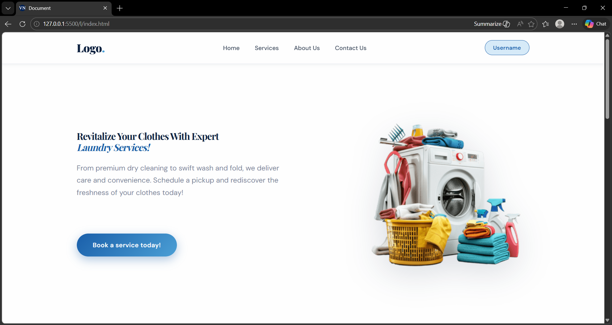

# 🧺 LaundryWalla – Service Booking Web App

<p align="center">
  
</p>

---

## 📌 Project Overview

**LaundryWalla** is a simple and interactive **laundry service booking web application** built using **HTML, CSS, and JavaScript**.
Users can select services, view them in a cart, and book them online. A confirmation email is sent after booking.

---

## 🚀 Features

* ✅ Add / Remove laundry services
* ✅ Dynamic cart with real-time total calculation
* ✅ Booking form with validation (Name, Email, Phone)
* ✅ Email confirmation using EmailJS
* ✅ Success message after booking
* ✅ Clean and user-friendly UI

---

## 🧑‍💻 Technologies Used

* HTML5
* CSS3
* JavaScript (Vanilla JS)
* EmailJS

---

## 📂 Project Structure

```
LaundryWalla/
│── index.html
│── style.css
│── script.js
│── home-page_screenshot.png
│── README.md
```

---

## ⚙️ How It Works

1. User selects services (e.g., Washing, Ironing, Dry Cleaning)
2. Selected services appear in the cart
3. Total price updates automatically
4. User fills booking form
5. On clicking **"Book Now"**:

   * Form is validated
   * Booking details are sent via EmailJS
   * Success message is displayed

---

## 🔧 Setup Instructions

1. Clone the repository:

```
git clone https://github.com/your-username/laundrywalla.git
```

2. Open the folder:

```
cd laundrywalla
```

3. Run the project:

* Open `index.html` in your browser

---

## 📧 EmailJS Setup

1. Create an account on https://www.emailjs.com
2. Create:

   * Service ID
   * Template ID
   * Public Key
3. Update in `script.js`:

```javascript
emailjs.send("YOUR_SERVICE_ID", "YOUR_TEMPLATE_ID", templateParams)
```

---

## 🎯 Future Improvements

* 🔹 Add quantity selection
* 🔹 Store cart using localStorage
* 🔹 Improve mobile responsiveness
* 🔹 Add animations for better UX

---

## 🙋‍♀️ Author

**Vaishnavi**

* GitHub: https://github.com/vaishnavi070905

---

## 📜 License

This project is created for educational purposes.
